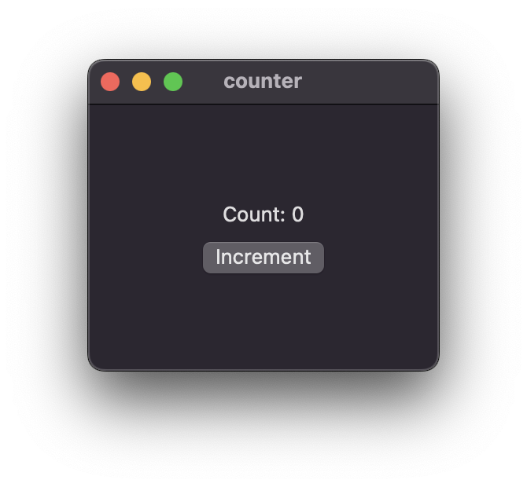
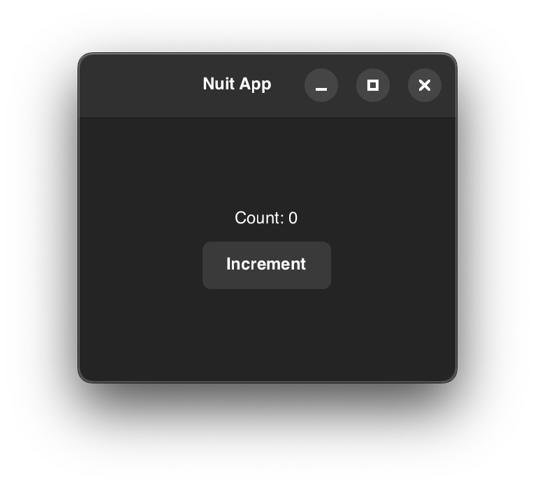

# Nuit

[](https://github.com/fwcd/nuit/actions/workflows/build.yml)

A declarative, cross-platform UI framework for Rust that uses native controls.

| Crate | Description | Version | Docs |
| - | - | - | - |
| [nuit](./nuit) | Umbrella crate for the framework | [](https://crates.io/crates/nuit) | [](https://docs.rs/nuit) |
| [nuit-bridge-adwaita](./nuit-bridge-adwaita) | Adwaita backend (Linux, macOS) | [](https://crates.io/crates/nuit-bridge-adwaita) | [](https://docs.rs/nuit-bridge-adwaita) |
| [nuit-bridge-swiftui](./nuit-bridge-swiftui) | SwiftUI backend (macOS, iOS) | [](https://crates.io/crates/nuit-bridge-swiftui) | [](https://docs.rs/nuit-bridge-swiftui) |
| [nuit-core](./nuit-core) | Core structures and traits | [](https://crates.io/crates/nuit-core) | [](https://docs.rs/nuit-core) |
| [nuit-derive](./nuit-derive) | Derive macros | [](https://crates.io/crates/nuit-derive) | [](https://docs.rs/nuit-derive) |

## About the Project

The API takes inspiration from contemporary reactive frameworks like SwiftUI, Xilem and React. A central design goal is to avoid using too much macro magic and instead heavily leverage associated types, traits and generics.

A simple hello world program in Nuit takes only a single line:

```rust
nuit::run_app(Text::new("Hello world!"));
```

For a more elaborate example, check out [the section below](#example).

> [!IMPORTANT]
> Nuit is still experimental with a rapidly evolving API. As such, treat this library as a sandbox rather than as a finished product, especially if you intend to write an app with it.
> 
> While the SwiftUI backend can be considered the reference implementation of the Nuit API, the Adwaita backend is still in early development and does not cover the full API surface yet.
> 
> The library also requires a nightly Rust toolchain due to its use of a number of unstable compiler features:
>
> - [impl Trait in type aliases](https://github.com/rust-lang/rust/issues/63063)
> - [associated type defaults](https://github.com/rust-lang/rust/issues/29661)
> - [macro metavariable expressions](https://github.com/rust-lang/rust/issues/83527)
> - [`let` chains](https://github.com/rust-lang/rust/issues/53667)
> - [reentrant locks](https://github.com/rust-lang/rust/issues/121440)
>
> With `rustup` this can be configured conveniently on a per-directory basis `rustup override set nightly` or, as in this repository, automatically with a [`rust-toolchain.toml`](rust-toolchain.toml).

## Example

```rust
use nuit::{Text, VStack, View, Bind, Button, State};

#[derive(Bind, Default)]
struct CounterView {
    count: State<i32>,
}

impl View for CounterView {
    type Body = impl View;

    fn body(&self) -> Self::Body {
        let count = self.count.clone();
        VStack::new((
            Text::new(format!("Count: {}", count.get())),
            Button::with_text("Increment", move || {
                count.set(count.get() + 1);
            })
        ))
    }
}

fn main() {
    nuit::run_app(CounterView::default());
}
```

Running this example with

```sh
cargo run --example counter
```

will launch the app with the platform-specific default backend, e.g. SwiftUI on macOS:



Using the Adwaita/GTK4 backend the app looks as follows:



> [!TIP]
> On platforms that support multiple backends (currently only macOS) you can explicitly choose a backend via the `NUIT_BACKEND` environment variable:
>
> ```sh
> NUIT_BACKEND=adwaita cargo run --example counter
> ```

## Note on Contributions

While the project is under GPL and you should feel free to use and modify the code under this license, I currently cannot take (GPL-only) contributions, since I intend to use this framework for apps on the app store (for which I dual-license it myself). I may decide to go with a CLA or a more permissive license in the future, but for now the project is open-source, not open-contribution.
