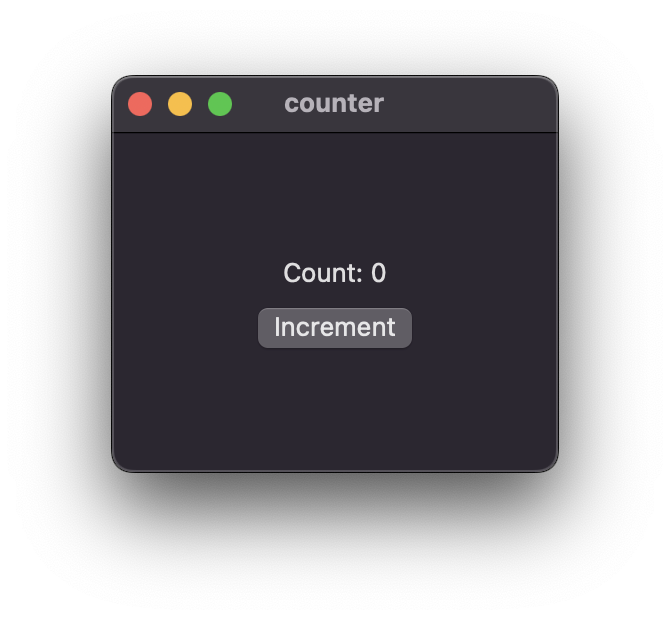

# Nuit

[](https://github.com/fwcd/nuit/actions/workflows/build.yml)

A declarative, cross-platform UI library for Rust that uses native controls.

Nuit's API takes inspiration from SwiftUI, Xilem, React and a number of other frameworks, while itself using SwiftUI under the hood on macOS.

> [!NOTE]
> Nuit currently requires a nightly Rust toolchain as it uses some unstable compiler features, e.g. [impl Trait in type aliases](https://github.com/rust-lang/rust/issues/63063), [associated type defaults](https://github.com/rust-lang/rust/issues/29661) and the [never type `!`](https://github.com/rust-lang/rust/issues/35121). With `rustup` this can be configured conveniently on a per-directory basis `rustup override set nightly` or, as in this repository, automatically with a `rust-toolchain.toml`.

## Example

```rust
use nuit::{Text, VStack, View, Bind, Button, State};

#[derive(Bind)]
struct CounterView {
    count: State<i32>,
}

impl CounterView {
    fn new() -> Self {
        Self { count: State::new(0) }
    }
}

impl View for CounterView {
    type Body = impl View;

    fn body(&self) -> Self::Body {
        let count = self.count.clone();
        VStack::new((
            Text::new(format!("Count: {}", count.get())),
            Button::new(Text::new("Increment"), move || {
                count.set(count.get() + 1);
            })
        ))
    }
}

fn main() {
    nuit::run_app(CounterView::new());
}
```

Running this example, e.g. with `cargo run --example counter`, launches:



